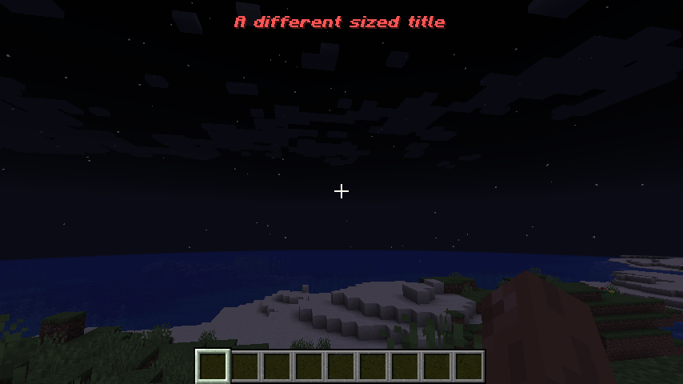
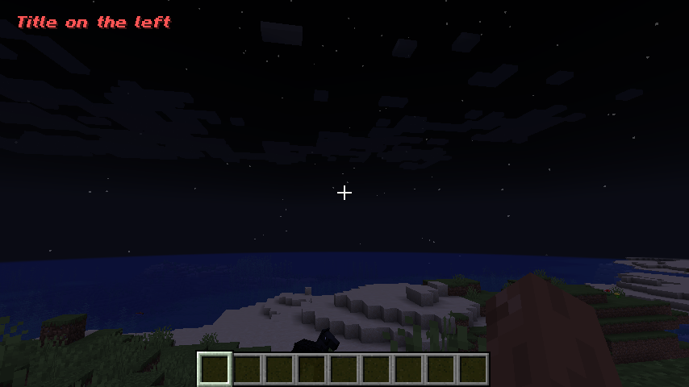

# Smaller Titles





## Setup

Drop the jar in the mods folder.

## Configuration

The mod creates a file named `smaller_titles.properties` in the config folder of the mod loader.
```
showSubTitles=true
showTitles=true
subtitleScaleInX=0.5
subtitleScaleInY=0.5
subtitleScaleInZ=0.5
subtitleXOffset=0
subtitleYOffset=80
titleScaleInX=1.0
titleScaleInY=1.0
titleScaleInZ=1.0
titleXOffset=0
titleYOffset=100
```
To change the size of the **titles**, edit the float values of `titleScaleInX`, `titleScaleInY`, and `titleScaleInZ`

To change the location in the screen of the **titles**, change the `titleXOffset` and `titleYOffset` integer values

`showTitles` is a boolean that indicates whether to show the titles. Possible values are `true` or `false`

`showSubTitles` is a boolean that indicates whether to show the subtitles. Possible values are `true` or `false`

To change the size of the **subtitles**, edit the float values of `subtitleScaleInX`, `subtitleScaleInY`, and `titleScaleInZ`

To change the location in the screen of the **_subtitles_**, change the `subtitleXOffset` and `subtitleYOffset` integer values

## Commands
The mod introduces 4 commands
1. `/smaller_titles title <enabled>` - to enable or disable the subtitles from rendering
2. `/smaller_titles subtitle <enabled>` to enable or disable the subtitles from rendering
3. `/smaller_titles title <enabled> <yOffset> <xOffset> <xScale> <yScale> <zScale>` to set whether the titles are enabled, their size, and location on the screen
4. `/smaller_titles subtitle <enabled> <yOffset> <xOffset> <xScale> <yScale> <zScale>` to set whether the subtitles are enabled, their size, and location on the screen

### Examples:
1. `/smaller_titles title false` - disables the titles
2. `/smaller_titles subtitle false` disables the titles
3. `/smaller_titles title true 100 200 0.5 0.5 0.5` enables the titles and sets it at 100 pixels less than where the game was going to put it originally in the y axis 
and 200 pixels less than where the game was going to put it originally in the x axis.
Then it sets the titles size to be 0.5 of the original size.

## Notes
This mod offsets the position in pixels of titles and subtitles. That means that if you go fullscreen and set it up like that, when you go out of full screen, the number of pixels in your screen change and so will the titles/subtitles position. They might become invisible due to it going out of bounds.
If that happens, you can delete the config file and restart the game. That will reset it to default.
## License

[The Unlicense](https://unlicense.org/)